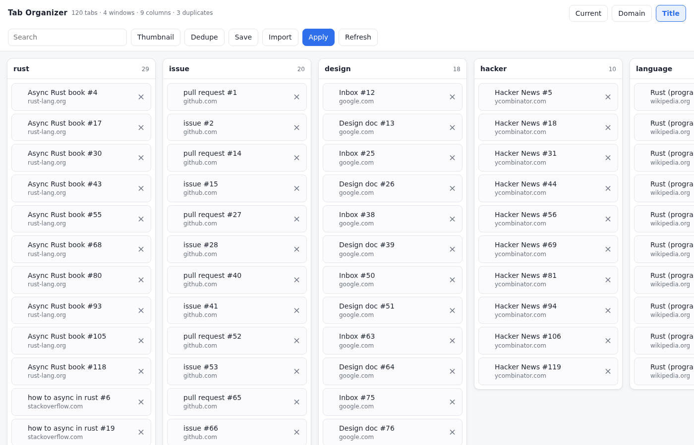

# Tab Organizer

A Firefox add-on that opens a full-page tab manager in its own tab.



## Install

1. Open `about:debugging#/runtime/this-firefox`.
2. Click **Load Temporary Add-on…**.
3. Select `manifest.json` in this folder.
4. Click the **Tab Organizer** toolbar button.

Temporary add-ons vanish when Firefox restarts. Click **Reload** on that same
page after editing the code.

To keep it across restarts on Developer Edition, Nightly, or ESR: set
`xpinstall.signatures.required` to `false` in `about:config`, zip this folder's
_contents_, rename the `.zip` to `.xpi`, and install it from `about:addons` →
gear → _Install Add-on From File_. Release Firefox refuses unsigned add-ons
whatever that setting says; submit to
[addons.mozilla.org](https://addons.mozilla.org/developers/) for signing.

## Use

Nothing moves in the browser until you click **Apply**.

| Control   | Does                                                                  |
| --------- | --------------------------------------------------------------------- |
| Current   | Columns are your windows as they are                                  |
| Domain    | One column per site, subdomains folded together                       |
| Title     | Columns by shared words in the title, falling back to the URL         |
| Search    | Hides tabs that don't match. Fuzzy, so `invioce` finds `invoice`      |
| Enter     | Groups the matches into a new column. Repeat to add more              |
| Escape    | Drops all search groups                                               |
| Thumbnail | Adds a page snapshot to each card. Asks for permission the first time |
| Retry     | Appears when snapshots time out; tries those again                    |
| Dedupe    | Closes repeated URLs, keeping the leftmost                            |
| Save      | Writes the columns to a JSON file                                     |
| Import    | Opens a saved file, one new window per column                         |
| Apply     | Rearranges your real windows to match the columns                     |
| Refresh   | Reloads the tab list                                                  |

Drag a card between columns or within one. Drag a column header to reorder the
board; that moves nothing in the browser. Double-click a card to jump to it,
`×` closes it. The `×` on a search column ungroups it.

## Develop

```sh
npm test         # unit tests for the pure logic
npm run test:ui  # drives the real UI headless, regenerates the screenshots
```

`npm run test:ui` needs Playwright and a browser binary. Point `PW_MODULE` at an
installed `playwright/index.mjs` if it isn't resolvable:

```sh
PW_MODULE=/path/to/node_modules/playwright/index.mjs npm run test:ui
```

See `AGENTS.md` for conventions.
