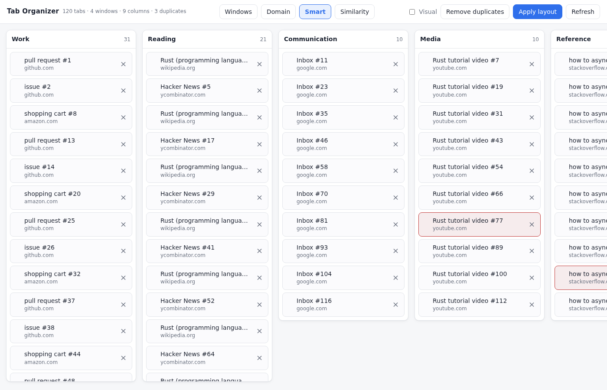

# Tab Organizer

A Firefox add-on that opens a full-page tab manager in its own tab. See every
open tab across every window, regroup them by window, domain, intent or
similarity, drag tabs between windows, remove duplicates, and **apply** the new
arrangement back to the browser.



## Why it's an add-on, not just a webpage

A normal web page can't read or move your browser tabs — only a WebExtension can
(`browser.tabs` / `browser.windows`). So this is a small Firefox add-on whose UI
_is_ a webpage: click the toolbar button and it opens the manager in a regular
tab.

## Install (temporary — no signing needed)

Temporary add-ons load instantly and stay until you restart Firefox. Good for
personal use.

1. Open Firefox and go to `about:debugging#/runtime/this-firefox`.
2. Click **Load Temporary Add-on…**.
3. Select the `manifest.json` file in this folder.
4. A **Tab Organizer** button appears in the toolbar. Click it to open the
   manager.

To reload after editing the code, click **Reload** next to the add-on on that
same `about:debugging` page.

### Install permanently (optional)

Temporary add-ons vanish on restart. To keep it:

- **Firefox Developer Edition / Nightly / ESR:** set
  `xpinstall.signatures.required` to `false` in `about:config`, then zip this
  folder's _contents_ (not the folder itself), rename the `.zip` to `.xpi`, and
  install via `about:addons` → gear → _Install Add-on From File_. Release Firefox
  refuses unsigned add-ons regardless of this setting.
- **Any Firefox:** submit the packaged add-on to
  [addons.mozilla.org](https://addons.mozilla.org/developers/) for signing.

## Using it

**Views.** Each button regroups the same tabs; nothing moves in the browser until
you click _Apply layout_.

| View       | Grouping                                                                                                                                                                             |
| ---------- | ------------------------------------------------------------------------------------------------------------------------------------------------------------------------------------ |
| Windows    | The windows as they are right now                                                                                                                                                    |
| Domain     | By site, with subdomains folded together (`mail.` + `docs.google.com`)                                                                                                               |
| Smart      | By what a tab is _for_ — Work, Communication, Docs & Writing, Reading, Reference, Media, Social, Search. Unrecognized tabs fall back to similarity so nothing lands in a junk drawer |
| Similarity | Clusters by shared words in URL + title, so related tabs group even across different sites                                                                                           |

**Each tab** shows favicon, title, and host. Double-click a card to jump to that
tab; the `×` closes it.

**Visual** toggle adds a small page thumbnail to each card. It asks for the
content-access permission only when you turn it on, so a default install stays
minimal-permission. Thumbnails load lazily as you scroll, which is what keeps
100+ tabs responsive.

**Remove duplicates** finds tabs with the same URL — ignoring `www.`, trailing
slashes, fragments, and tracking params like `utm_*` — keeps the leftmost of each
set and closes the rest. Duplicates are flagged with a red edge before you click.

**Drag** any card into another column to rearrange, then **Apply layout** to
materialize the columns into real Firefox windows. Existing windows are reused
where possible to keep the disruption small.

## Development

```sh
npm test        # unit tests for the pure logic
npm run test:ui # optional: drives the real UI in a headless browser
```

All organization logic lives in `src/logic.js` as pure, browser-free functions,
so it's unit-tested directly under `node --test`. The UI (`src/manager.js`) is
the only part that touches the WebExtension APIs.

`npm run test:ui` builds `_harness.html` — the real page wired to a mocked
`browser` API seeded with 120 fake tabs — and drives it with Playwright to check
rendering, every view, dedupe, drag-and-drop, and apply. It needs Playwright and
a browser binary; skip it if you don't have them.

## Layout

```
manifest.json      add-on manifest (MV3, Firefox)
manager.html/css   the full-page UI
src/background.js   opens the manager when the toolbar button is clicked
src/manager.js      UI: rendering, drag/drop, actions, lazy thumbnails
src/logic.js        pure logic: canonicalize, dedupe, views, intent, clustering, apply planner
test/               unit tests + the UI harness/driver
```

## Style

Clean, professional, minimal — card columns, one blue accent, red reserved for
destructive actions and duplicate flags. Colors live as CSS custom properties at
the top of `manager.css` and follow the system light/dark preference.
