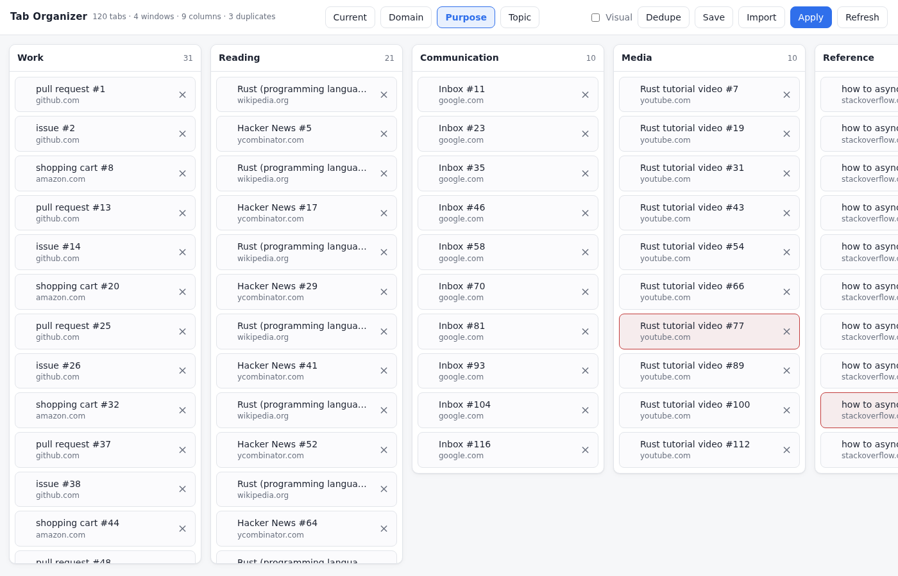

# Tab Organizer

A Firefox add-on that opens a full-page tab manager in its own tab.



## Install

Temporary add-ons load instantly and stay until you restart Firefox.

1. Open `about:debugging#/runtime/this-firefox`.
2. Click **Load Temporary Add-on…**.
3. Select `manifest.json` in this folder.
4. Click the **Tab Organizer** toolbar button to open the manager.

After editing the code, click **Reload** next to the add-on on that same page.

To keep it across restarts on Developer Edition, Nightly, or ESR: set
`xpinstall.signatures.required` to `false` in `about:config`, zip this folder's
_contents_, rename the `.zip` to `.xpi`, and install it from `about:addons` →
gear → _Install Add-on From File_. Release Firefox refuses unsigned add-ons
whatever that setting says; for those, submit the add-on to
[addons.mozilla.org](https://addons.mozilla.org/developers/) for signing.

## Development

```sh
npm test         # unit tests for the pure logic
npm run test:ui  # drives the real UI headless, and regenerates the screenshots
```

`npm run test:ui` needs Playwright and a browser binary. It builds
`_harness.html` (the real page wired to a mocked `browser` API seeded with 120
fake tabs), drives it, and writes `test/screenshots/`, including the image at the
top of this file. Point `PW_MODULE` at an installed `playwright/index.mjs` if it
isn't resolvable locally:

```sh
PW_MODULE=/path/to/node_modules/playwright/index.mjs npm run test:ui
```

See `AGENTS.md` for conventions and the pure/UI split.
